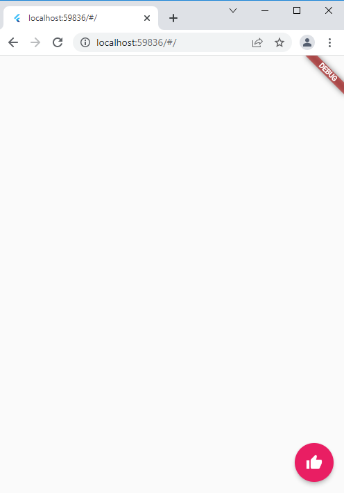
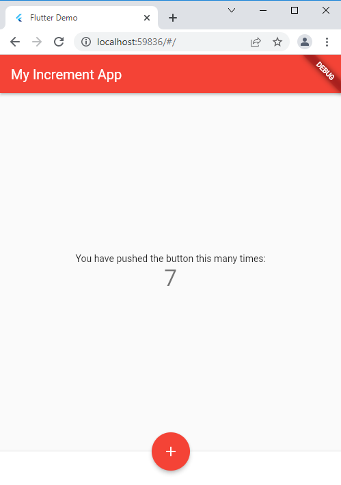
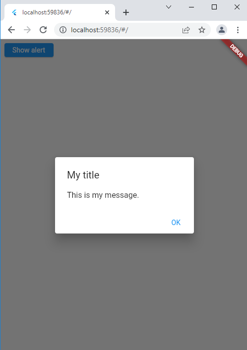
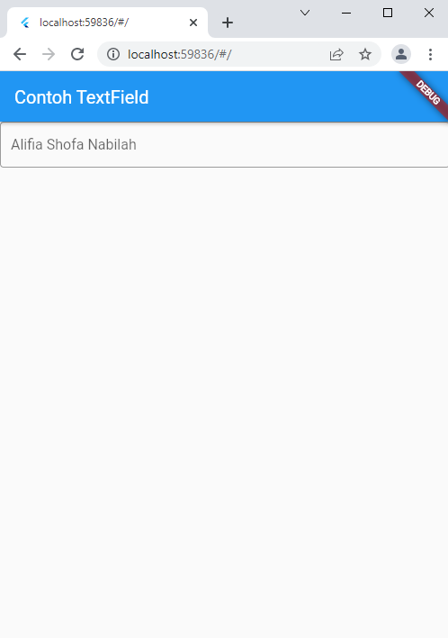
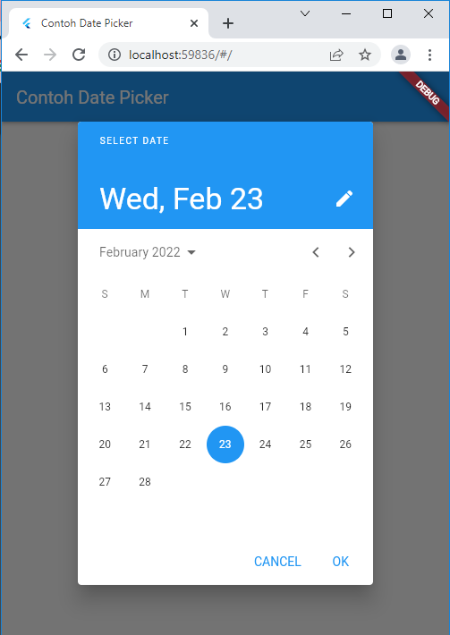
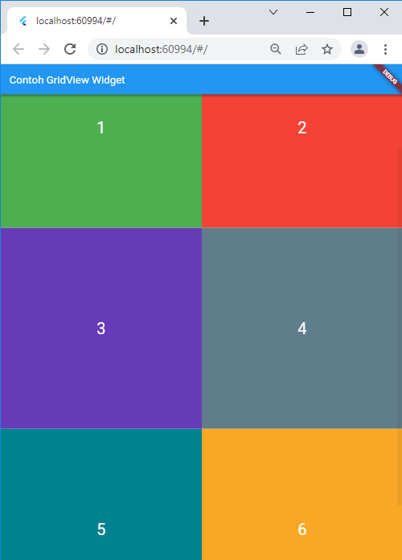
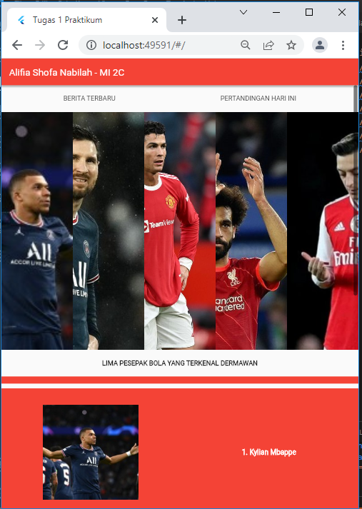

# flutter_basic

NIM     : 2031710027   Nama    : Alifia Shofa' Nabilah   Kelas   : MI-2C   Prodi   : D3-Manajemen Informatika

## Hasil Praktikum
1. 
2. 
3. 
4. 
5. 
6. 
7. 
8. 
9. 
10. 
11. 
12. 
13. 
14. 
15. 
16. 
17. 
18. 
19. 
20. 
21. 
22. 
23. .png)